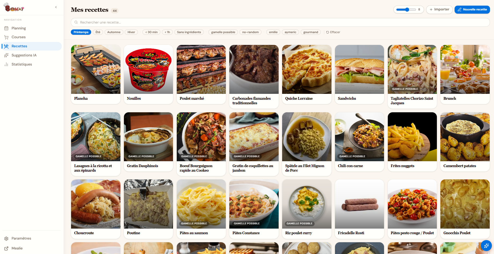
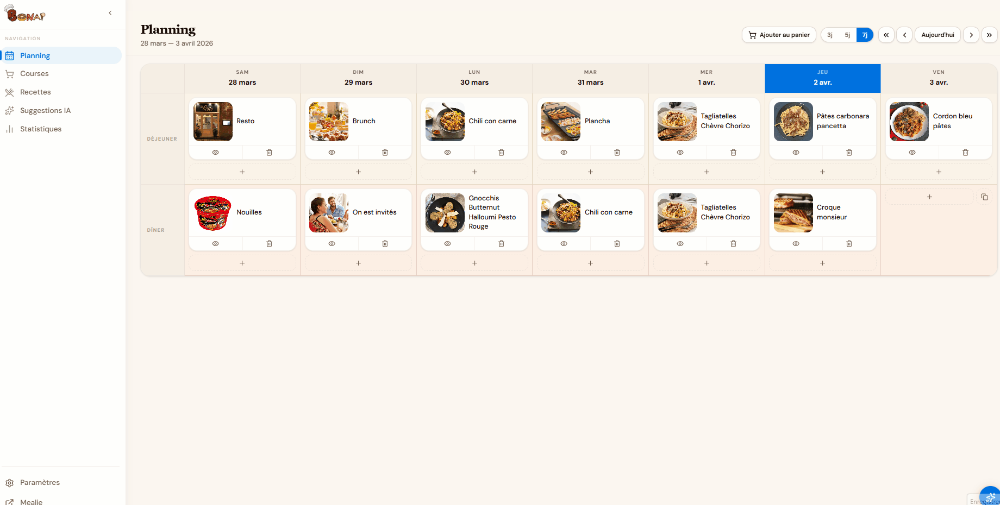
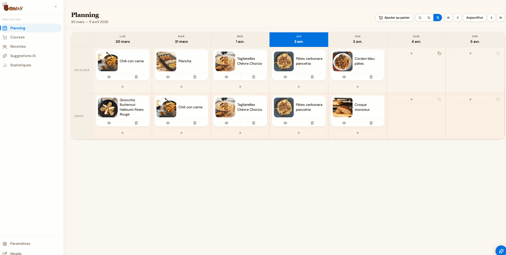
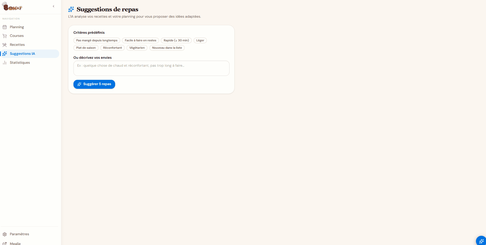
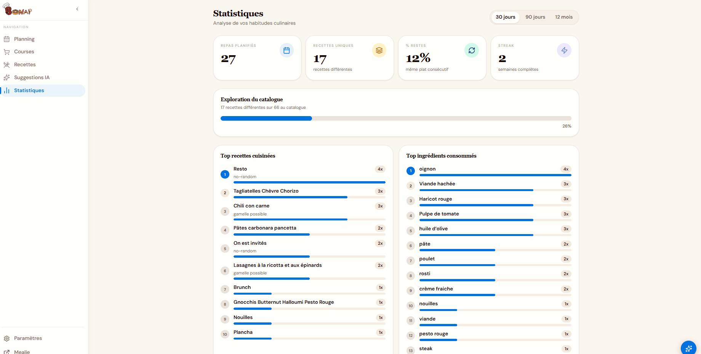

# Bonap

[](LICENSE)
[](https://github.com/AymericLeFeyer/bonap/pkgs/container/bonap)
[](https://react.dev)
[](https://www.typescriptlang.org)
[](https://mealie.io)

**Bonap** is a modern, ergonomic front-end for [Mealie](https://mealie.io) — a self-hosted recipe manager. It connects to your existing Mealie instance without touching its backend, and adds features like AI-powered suggestions, meal planning, a smart shopping list, and customizable themes.

> [!NOTE]
> Bonap is a pure front-end. It requires a running Mealie instance to work.



---

## Features

- **Recipes** — grid view with search, filters (category, tag, duration, season), infinite scroll

  

- **Meal planning** — weekly calendar (lunch + dinner), day-by-day navigation, leftovers shortcut

  

- **Shopping list** — auto-populated from meal plan, grouped by label, "Regulars" second list

  

- **AI suggestions & assistant** — 5 recipe suggestions + floating chat drawer (search, add to plan, create recipes)

  

- **Stats** — top recipes, top ingredients, streak, leftovers %, catalogue coverage

  

- **Recipe editor** — full create/edit form with ingredient autocomplete, AI-generated photo
- **Themes** — light / dark / system, 8 accent colors (oklch)

---

## Requirements

- A running [Mealie](https://mealie.io) instance
- A Mealie API token (Mealie → Profile → API Tokens)
- Node.js 20+ (for local dev) **or** Docker (for production)

---

## Quick start — Docker (recommended)

### Option A — Bonap only (Mealie already running elsewhere)

```bash
docker run -d \
  -p 3000:80 \
  -e VITE_MEALIE_URL=http://your-mealie-host:9000 \
  -e VITE_MEALIE_TOKEN=your_api_token \
  --restart unless-stopped \
  ghcr.io/AymericLeFeyer/bonap:latest
```

Open [http://localhost:3000](http://localhost:3000).

Or with Docker Compose — copy `docker-compose.yml`, fill in your values, and run:

```bash
docker compose up -d
```

### Option B — Full stack (Bonap + Mealie from scratch)

```bash
docker compose -f docker-compose.full.yml up -d
```

**First-time setup:**

1. Go to [http://localhost:9000](http://localhost:9000) and create an admin account
2. Navigate to **Profile → API Tokens** and generate a token
3. Edit `docker-compose.full.yml` and set `VITE_MEALIE_TOKEN` to your token
4. Restart Bonap: `docker compose -f docker-compose.full.yml restart bonap`

Bonap is available at [http://localhost:3000](http://localhost:3000).

---

### Option C — Home Assistant addon

If you run Home Assistant OS or Supervised, you can install Bonap as a native HA addon.

1. Go to **Settings → Add-ons → Add-on Store**
2. Click the **three-dot menu** (top right) → **Repositories**
3. Add the following URL:
   ```
   https://github.com/AymericLeFeyer/bonap
   ```
4. Refresh — **Bonap** appears in the store. Install it.
5. In the **Configuration** tab, set your Mealie URL and API token, then **Start**.

Bonap will be accessible via the **OPEN WEB UI** button and from the HA sidebar (ingress).

> See [`ha-addon/`](ha-addon/) for the full addon source.

---

## Quick start — Local dev

```bash
git clone https://github.com/AymericLeFeyer/bonap
cd bonap
npm install
```

Create a `.env` file at the project root:

```env
VITE_MEALIE_URL=http://your-mealie-host:9000
VITE_MEALIE_TOKEN=your_api_token
```

Start the dev server:

```bash
npm run dev
```

Open [http://localhost:5173](http://localhost:5173).

> Vite automatically proxies `/api/*` to `VITE_MEALIE_URL` in dev mode — no CORS issues.

---

## Environment variables

| Variable | Required | Description |
|---|---|---|
| `VITE_MEALIE_URL` | Yes | URL of your Mealie instance, **as seen from the browser** |
| `VITE_MEALIE_TOKEN` | Yes | Mealie API Bearer token (Profile → API Tokens) |
| `MEALIE_INTERNAL_URL` | No | Internal URL for the nginx `/api` proxy. Defaults to `VITE_MEALIE_URL`. Use this when Mealie is reachable inside Docker by a service name (e.g. `http://mealie:9000`) while `VITE_MEALIE_URL` points to the external host. |
| `LLM_PROVIDER` | No | AI provider: `anthropic`, `openai`, `google`, or `ollama`. If set, overrides the in-app setting on all devices. |
| `LLM_API_KEY` | No | API key for the AI provider. If set, the key is shared across all devices automatically. |
| `LLM_MODEL` | No | AI model to use (e.g. `claude-sonnet-4-6`). If set, overrides the in-app model selector. |
| `LLM_OLLAMA_URL` | No | Base URL of your Ollama instance (e.g. `http://ollama:11434`). Used when `LLM_PROVIDER=ollama`. |

> In Docker, all variables are injected at **container startup** (not at build time) via `window.__ENV__`. This means a single image works for any configuration — no rebuild needed. LLM variables set here are applied on all devices/browsers automatically.

---

## Docker details

### Image

```
ghcr.io/AymericLeFeyer/bonap:latest        # latest stable (main branch)
ghcr.io/AymericLeFeyer/bonap:<sha>         # pinned to a specific commit
```

### Build stages

The image uses a two-stage build:

| Stage | Base | Purpose |
|---|---|---|
| `builder` | `node:24-alpine` | Installs dependencies, runs `vite build` |
| `runner` | `nginx:1.27-alpine` | Serves static files, proxies `/api` to Mealie |

### nginx proxy

In production, nginx handles two responsibilities:

```
Browser → :3000/api/*  →  nginx  →  Mealie (internal URL)
Browser → :3000/*      →  nginx  →  dist/ (static files, SPA fallback)
```

This replicates the Vite dev proxy — the browser never makes cross-origin requests to Mealie directly.

### Build locally

```bash
docker build -t bonap:local .

docker run -p 3000:80 \
  -e VITE_MEALIE_URL=http://your-mealie:9000 \
  -e VITE_MEALIE_TOKEN=your_token \
  bonap:local
```

### CI/CD — GitHub Actions

A Docker image is automatically built and pushed to GHCR on every push to `main`:

- `.github/workflows/docker.yml`
- Tags: `latest` + short SHA

---

## Local dev commands

```bash
npm run dev      # Dev server on localhost:5173 with Mealie + LLM proxies
npm run build    # TypeScript check + Vite production build → dist/
npm run preview  # Serve the production build locally
npm run lint     # ESLint + Prettier check
```

---

## Tech stack

| Tool | Role |
|---|---|
| React 19 + Vite | Framework & bundler |
| TypeScript 5 (strict) | Static typing |
| Tailwind CSS v4 | Utility-first styles |
| shadcn/ui (Radix UI) | UI components |
| React Router v7 | Client-side routing |
| lucide-react | Icons |
| Anthropic API | AI suggestions & assistant |

Architecture follows **Domain-Driven Design (DDD)**: `domain` → `application` → `infrastructure` → `presentation`.

---

## LLM / AI configuration

Bonap supports multiple AI providers for the suggestion engine and the assistant drawer. Configure them in **Settings**.

| Provider | Streaming | Tool use (assistant) |
|---|---|---|
| Anthropic | Yes | Yes |
| OpenAI | No (fallback) | No |
| Google Gemini | No (fallback) | No |
| Ollama (local) | No (fallback) | No |

> For the full assistant experience (tool use + streaming), Anthropic is required.

In dev mode, Vite proxies AI provider APIs to avoid CORS:
- `/anthropic` → `https://api.anthropic.com`
- `/openai` → `https://api.openai.com`
- `/google-ai` → `https://generativelanguage.googleapis.com`

---

## Contributing

1. Fork the repository
2. Create a feature branch: `git checkout -b feat/my-feature`
3. Commit your changes
4. Open a pull request

---

## License

MIT
